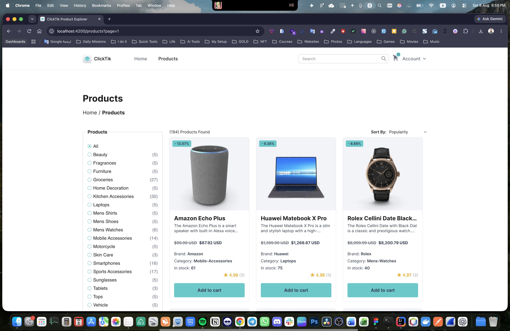
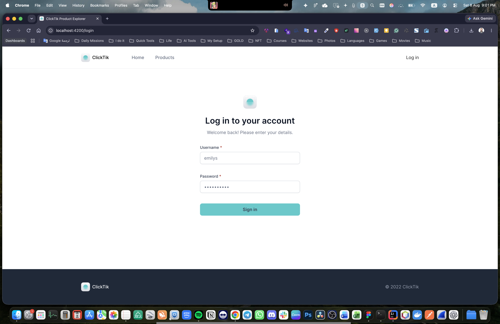
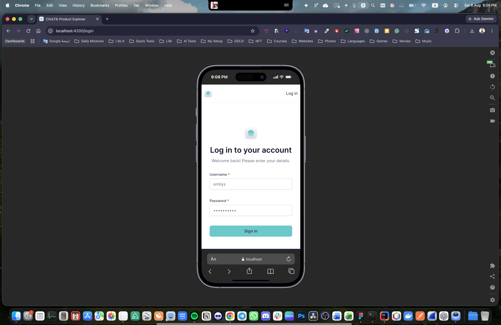
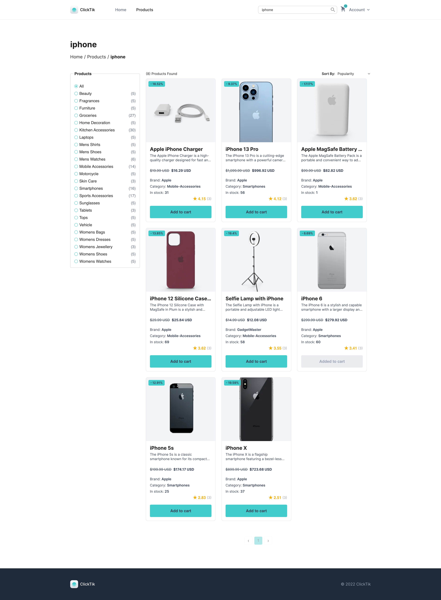

# Pleny Product Explorer

An Angular 21 product explorer built as a technical-assessment application. Users can sign in, browse a shareable product catalogue, search and filter products, sort and paginate results, add products to a cart, and switch between light and dark themes.

The project is intentionally small and explainable: standalone OnPush components, a feature-based folder structure, typed API services, NgRx SignalStore for application state, and RxJS only where asynchronous workflows need cancellation or coordination.

## Live demo

[Open the live application](https://your-live-app-url.example.com)

> Deployment placeholder: replace `https://your-live-app-url.example.com` with the real application URL after deployment.

## What is included

- Angular 21 standalone application with zoneless change detection.
- DummyJSON authentication with access-token attachment and coordinated refresh.
- Cookie-backed authentication session persistence.
- Protected, lazy-loaded Products route.
- URL-driven page, search, category, sorting, and browser history state.
- Debounced, cancellable product search using `debounceTime`, `distinctUntilChanged`, and `switchMap`.
- Category radio filters with loading, retry, and product-count states.
- Responsive product grid with loading, empty, and error feedback.
- Accessible shared Button, Text Field, Breadcrumb, Pagination, Product Card, and Cart Badge components.
- Optimistic cart count updates with rollback on add failure.
- Light/dark theme toggle with system preference fallback and persistence.
- Vitest unit tests using Angular testing utilities.

## Screens and routes

| Route       | Access    | Purpose                                                                 |
| ----------- | --------- | ----------------------------------------------------------------------- |
| `/home`     | Public    | Landing page and entry point to the explorer                            |
| `/login`    | Public    | Username/password authentication                                        |
| `/products` | Protected | Product listing, search, filters, sorting, pagination, and cart actions |
| `/`         | Public    | Redirects to `/home`                                                    |

The Products route accepts query parameters such as:

```text
/products?page=2&search=phone&category=smartphones&sortBy=price&order=asc
```

The URL is the source of truth. Refresh, direct links, and browser back/forward navigation restore the same product view.

## Screenshots

<table>
  <tr>
    <td align="center"><strong>Products page</strong></td>
    <td align="center"><strong>Login page</strong></td>
  </tr>
  <tr>
    <td></td>
    <td></td>
  </tr>
  <tr>
    <td align="center"><strong>Login page on mobile</strong></td>
    <td align="center"><strong>Search results</strong></td>
  </tr>
  <tr>
    <td></td>
    <td></td>
  </tr>
</table>

## Quick start

### Prerequisites

- Node.js `20.19+`, `22.12+`, or a newer supported Angular 21 version.
- npm `8+`.

### Install and run

```bash
npm ci
npm start
```

Open [http://localhost:4200](http://localhost:4200).

The development server watches source files and reloads the application after changes.

### Useful commands

```bash
# Development server
npm start

# Production build
npm run build

# Unit tests in non-watch mode
npm test -- --watch=false

# TypeScript application check
npx tsc --noEmit -p tsconfig.app.json

# TypeScript test check
npx tsc --noEmit -p tsconfig.spec.json

# Development build in watch mode
npm run watch
```

There is no end-to-end test script in this repository yet; `npm test` runs the configured Vitest suite.

## Demo login

DummyJSON demo credentials used by the application and tests:

```text
Username: emilys
Password: emilyspass
```

These are public demo credentials, not real user credentials.

## Project structure

```text
src/
├── main.ts                         # Standalone Angular bootstrap
├── styles.scss                     # Global token/reset/typography imports
├── assets/
│   ├── images/                     # Logo and UI image assets
│   └── styles/                     # Design tokens and global SCSS partials
└── app/
    ├── app.config.ts               # HTTP, router, zoneless, and global providers
    ├── app.routes.ts               # Lazy routes and Products guard
    ├── app.ts                       # Root component and router outlet
    ├── core/                        # Application-wide infrastructure
    │   ├── auth/
    │   │   ├── contracts/           # AuthSessionStorage DI boundary
    │   │   ├── data-access/         # Auth API and AuthStore
    │   │   ├── guards/              # Functional protected-route guard
    │   │   ├── interceptors/        # Bearer token and refresh interceptor
    │   │   ├── models/              # Auth contracts
    │   │   ├── services/            # Cookie session and refresh coordination
    │   │   └── utils/               # Session and return-URL helpers
    │   ├── cart/                    # Global cart API, store, and models
    │   ├── config/                  # Injectable API configuration
    │   ├── layout/                  # Header, Router Outlet, Footer shell
    │   └── theme/                   # Theme state and document synchronization
    ├── features/                    # Business-owned screens and data
    │   ├── auth/pages/login/        # Login user experience
    │   ├── home/                    # Public Home page
    │   └── products/
    │       ├── components/          # Product-only Category Filter
    │       ├── data-access/         # Products API and ProductsStore
    │       ├── models/              # Product and URL-query contracts
    │       ├── utils/               # Query normalization and URL helpers
    │       └── products.*           # Route-level Products Page
    └── shared/
        ├── ui/                      # Reusable presentational components
        └── utilities/               # Small pure cross-feature helpers
```

Each meaningful folder has a local overview. Start with [`src/app/README.md`](src/app/README.md), then read the relevant [`core`](src/app/core/README.md), [`features`](src/app/features/README.md), or [`shared`](src/app/shared/README.md) guide. The complete shared component API is in [`src/app/shared/ui/README.md`](src/app/shared/ui/README.md).

## Architecture

### Core

`core/` contains singleton infrastructure only: authentication, cart state, theme state, API configuration, guards, interceptors, refresh coordination, and the global layout.

### Features

`features/` owns business journeys. Route-level pages coordinate URL state, stores, navigation, and child inputs. Feature data-access code owns typed API adapters and feature stores. Feature models and utilities stay close to their feature.

### Shared

`shared/` contains reusable UI and pure utilities that do not know about a feature store, API, or business route. Shared components receive typed signal inputs and emit user intent; parent pages decide what that intent means.

Folders are created only when a real file requires them. Empty architectural boilerplate is avoided.

## State and reactivity

### Signals and SignalStore

- `signal()` holds local mutable state such as drafts and theme preference.
- `computed()` derives read-only state such as authentication, totals, labels, and ARIA relationships.
- `linkedSignal()` keeps editable search/category drafts aligned with URL input changes.
- NgRx SignalStore owns Auth, Products, and Cart application state.
- `rxMethod()` bridges store signals into typed RxJS request workflows.

### RxJS

RxJS is used for asynchronous workflows, not as the primary UI state container:

- `switchMap` cancels stale product/search requests.
- `debounceTime` and `distinctUntilChanged` prevent unnecessary search calls.
- `catchError` is placed inside request workflows so one failed request does not permanently terminate the outer stream.
- `exhaustMap` prevents duplicate login/category initialization work.
- `mergeMap` supports independent cart-add requests while each product has its own loading state.

Effects are limited to true external side effects, such as theme/document synchronization, login redirect navigation, and canonical URL replacement. Derived state is expressed with `computed()` instead.

## Authentication and security

Authentication uses DummyJSON:

- `POST /auth/login`
- `POST /auth/refresh`

The flow is:

1. Login validates credentials and calls `AuthStore`.
2. The typed API response becomes an `AuthSession`.
3. Access token, refresh token, and user data are stored in separate cookies.
4. The interceptor attaches the in-memory access token to API requests.
5. Before protected requests, the interceptor re-reads the cookie session. Missing or changed cookies immediately clear AuthStore and reject the stale request.
6. A 401 starts one coordinated refresh request. Concurrent requests share the same refresh operation.
7. A successful refresh updates the cookie session and retries the original request once.
8. Refresh failure or a second 401 logs the user out.

Cookie attributes are `Path=/`, `SameSite=Lax`, seven-day `Max-Age`, and `Secure` over HTTPS. A browser application cannot set `HttpOnly`, so these cookies remain readable by JavaScript. Production authentication should use server-issued secure HttpOnly cookies, short-lived access tokens, refresh-token rotation/revocation, CSP, and server-enforced logout.

## Products data flow

Products use the DummyJSON Products API with a page size of nine:

- `/products?limit=9&skip=...`
- `/products/search?q=...&limit=9&skip=...`
- `/products/category/:slug?limit=9&skip=...`
- `sortBy` and `order` are passed to supported API requests.

The Products Store owns loading, error, results, totals, category metadata, and request cancellation. Products Page owns URL normalization and navigation. Combined search plus category filtering is handled by fetching the category collection, filtering searchable fields locally, sorting, and paginating the result because DummyJSON does not expose a documented combined endpoint.

The page distinguishes loading, retryable error, empty, and loaded states. Category counts are supplementary metadata; if their enrichment request fails, category filtering remains usable.

## Cart behavior

The Cart Store uses:

- `GET /carts/user/:userId`
- `POST /carts/add`

The Header badge represents total quantity across the user’s carts. Adding a product increments the count optimistically, marks that product as pending, and rolls the count back if the request fails. A successfully added product is disabled on the current screen to prevent duplicate add intents. DummyJSON cart persistence is simulated and should not be treated as a production cart backend.

## Design system and accessibility

Global SCSS tokens live in [`src/assets/styles/_tokens.scss`](src/assets/styles/_tokens.scss), with reset, typography, and utility partials imported by [`src/styles.scss`](src/styles.scss).

The design system covers:

- Light and dark semantic color roles.
- Typography families, sizes, weights, and line heights.
- Spacing, radii, borders, shadows, focus rings, transitions, and layout dimensions.
- Figma-derived desktop product geometry and documented responsive fallbacks.

The application uses semantic landmarks, native controls, visible `:focus-visible` states, labels, error associations, `aria-invalid`, `aria-describedby`, `aria-current`, `aria-live`, useful image alternatives, and keyboard-safe disabled behavior.

Design references and extracted Figma documentation are stored under [`.docs/Figma-Design`](.docs/Figma-Design). The implementation roadmap and decision log are in [`.docs/IMPLEMENTATION_PLAN.md`](.docs/IMPLEMENTATION_PLAN.md).

## Testing

Tests are colocated with the source files and run with Vitest through Angular’s unit-test builder. The suite covers:

- Auth API, AuthStore, cookie session storage, interceptor, refresh coordinator, and guard behavior.
- Products API, ProductsStore, query normalization, URL behavior, category filtering, and sorting.
- Cart API, CartStore optimistic updates, rollback, and duplicate prevention.
- Header, account menu, login page, and Home page behavior.
- Shared Button, Text Field, Breadcrumb, Pagination, Product Card, Cart Badge, and Category Filter components.

Run the complete suite with:

```bash
npm test -- --watch=false
```

## Deliberate limitations and future improvements

- DummyJSON is a public assessment API; authentication and cart persistence are not production-grade.
- Frontend-created cookies cannot be HttpOnly.
- DummyJSON does not provide a documented combined search/category endpoint, so that combination is filtered locally.
- The repository does not currently include an end-to-end test runner.
- `withEntities`, `httpResource()`, `rxResource()`, and `@defer` are not forced into stable flows where they would hide or complicate the required behavior. They can be evaluated when a genuine use case appears.
- Signal Forms are experimental Angular 21 APIs and are isolated to the login page with focused tests.
- Additional automated accessibility, visual regression, and responsive browser tests are future improvements.

## Contributing conventions

- Use standalone components and `ChangeDetectionStrategy.OnPush`.
- Use `inject()` instead of constructor parameter injection.
- Use `input()`, `output()`, `model()`, `computed()`, and `linkedSignal()` where they express the component contract.
- Use Angular built-in control flow (`@if`, `@for`, `@empty`, `@switch`).
- Keep every `@for` loop tracked by a meaningful stable identity.
- Keep styles in SCSS and consume design tokens instead of scattering colors or magic dimensions.
- Add focused tests beside changed behavior.
- Update the nearest folder README and the implementation decision log when architecture changes.

## License

This repository was created for a technical assessment. No separate open-source license has been declared.
